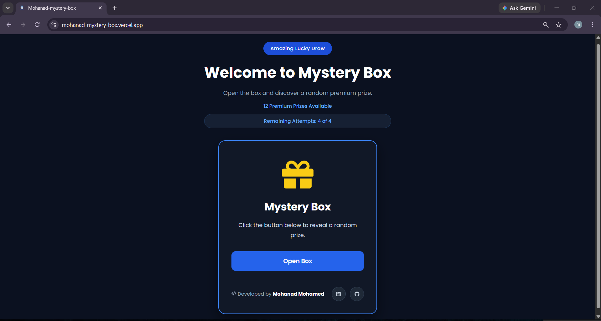

# 🎁 Mystery Box

<p align="center">
  
</p>

<p align="center">
  <strong>A modern React application that simulates an interactive mystery box experience.</strong>
</p>

<p align="center">


</p>

---

## 🌐 Live Demo

🔗 **https://mohanad-mystery-box.vercel.app/**

---

## 📸 Preview



---

## 📖 About

Mystery Box is a modern React application built with **React** and **Vite**.

The application allows users to open a virtual mystery box and reveal a random premium prize through an interactive interface with smooth animations.

It also includes a daily attempt system using **Local Storage**, making the experience more realistic while demonstrating practical React concepts.

---

## ✨ Features

- 🎁 Random premium prize selection
- 🚫 Prevents consecutive duplicate prizes
- ⏳ Loading animation while opening the box
- 🔒 Button disabled during loading
- 📅 Four attempts per day
- 💾 Daily attempts saved using Local Storage
- 🔄 Automatic reset every new day
- 🎨 Dynamic card color based on the selected prize
- 📱 Fully responsive design
- ⚛️ Built with React Hooks (`useState`, `useEffect`)

---

## 🛠️ Technologies

- React
- JavaScript (ES6+)
- CSS3
- React Icons
- Vite

---

## 📂 Project Structure

```text
src/
├── App.jsx
├── App.css
├── main.jsx

public/
└── Mystery-box-logo.png
```

---

## 🚀 Getting Started

### Clone the repository

```bash
git clone https://github.com/mohanadmohamed24136-web/mohanad-mystery-box.git
```

### Navigate to the project

```bash
cd mohanad-mystery-box
```

### Install dependencies

```bash
npm install
```

### Start the development server

```bash
npm run dev
```

---

## 💡 How It Works

1. Click **Open Box**.
2. Wait while the application randomly selects a prize.
3. A premium prize is revealed.
4. Each opening consumes one daily attempt.
5. Attempts automatically reset every new day.

---

## 📱 Responsive Design

The application is fully responsive and optimized for:

- Desktop
- Tablet
- Mobile

---

## 👨‍💻 Author

**Mohanad Mohamed**

- GitHub: https://github.com/mohanadmohamed24136-web
- LinkedIn: https://www.linkedin.com/in/mohanad-mohamed-017146379

---

## ⭐ Support

If you enjoyed this project, consider giving it a ⭐ on GitHub.

Thank you for visiting!